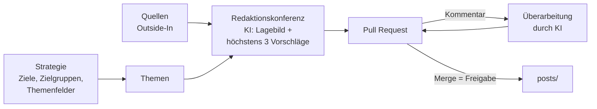

# Demo-Redaktion · Marietta-Blau-Hochschule für Technik

> **Fiktiv.** Die Marietta-Blau-Hochschule für Technik gibt es nicht. Dieses Repo zeigt, wie eine KI-gestützte Hochschulredaktion nach dem Newsroom-Modell arbeitet: von der Strategie der Hochschulleitung über die Redaktionskonferenz bis zur Freigabe. Es wird nichts veröffentlicht.
>
> Die Hochschule trägt den Namen von Marietta Blau (1894–1970), Wiener Physikerin. Sie entwickelte die fotografische Kernspuremulsion, musste 1938 emigrieren, und den Nobelpreis für die Methode erhielt 1950 ein anderer.

## Ablauf

1. **Strategie** (`strategie.md`): drei Ziele der Hochschulleitung, drei Zielgruppen, drei Themenfelder mit Kernbotschaften.
2. **Themen** (`themen.md`): was in welchem Zeitraum erzählt wird. Was dort nicht steht, findet nicht statt.
3. **Redaktionskonferenz:** Eine KI liest die Quellen, schreibt ein kurzes Lagebild und höchstens drei Vorschläge mit fertigen Entwürfen, abgewogen zwischen den drei Zielen. Ergebnis ist ein Pull Request.
4. **Redigieren:** Im Pull Request kommentieren, etwa `@claude Vorschlag 2 kürzer und ohne Fachbegriffe`. Die KI überarbeitet auf demselben Branch.
5. **Freigabe:** Merge. Der Verlauf dokumentiert Entwurf, Änderungen und Freigabe durch einen Menschen (vgl. Art. 50 Abs. 4 KI-VO).

## Konferenz auslösen

- **Knopf:** Actions → „Redaktionskonferenz“ → „Run workflow“.
- **Kommentar:** In einem Issue `@claude Konferenz` schreiben (geht auch in der GitHub-App).

Nur Personen mit Schreibrecht können eine Konferenz auslösen. Es gibt keinen Zeitplan, jeder Lauf ist bewusst ausgelöst.

## Aufbau

| Datei oder Ordner | Inhalt |
|---|---|
| `strategie.md` | Ziele, Zielgruppen, Themenfelder, Kernbotschaften, Leitplanken |
| `themen.md` | laufende Themen mit Botschaft und Laufzeit |
| `quellen.md` | feste Quellen für das Lagebild |
| `konferenz/` | eine Datei pro Konferenz: Lagebild und Vorschläge |
| `posts/` | freigegebene Beiträge, eine Datei pro Kanal |
| `CLAUDE.md` | Arbeitsregeln für die KI |

Kennungen: Themenfeld `TF1`, Thema `T1.1`, Inhalt `IN1.1.1`.
